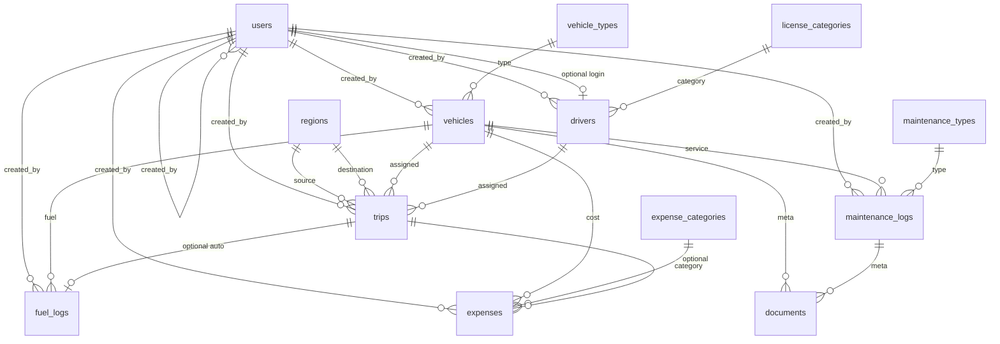

# 02 — Database Schema (v1 Locked Design)

> Implementation target for Drizzle/Postgres. **No code written yet** — this is the contract.

## 2.1 Postgres ENUMs (status machines only)

```sql
user_role:            fleet_manager | dispatcher | safety_officer | financial_analyst
vehicle_status:       available | on_trip | in_shop | retired
driver_status:        available | on_trip | off_duty | suspended
trip_status:          draft | dispatched | completed | cancelled
maintenance_status:   open | closed
notification_status:  pending | sent | failed | cancelled
document_entity_type: vehicle | maintenance_log
```

All other categorizations → **master tables**.

---

## 2.2 Master / config tables

### `regions`

| Column     | Type         | Null | Default           | Notes                                 |
| ---------- | ------------ | ---- | ----------------- | ------------------------------------- |
| id         | uuid         | NO   | gen_random_uuid() | **PK**                                |
| code       | varchar(32)  | NO   |                   | Unique business code e.g. `WEST-01`   |
| name       | varchar(120) | NO   |                   | Display name                          |
| is_active  | boolean      | NO   | true              | Inactive hidden from new trip selects |
| created_at | timestamptz  | NO   | now()             |                                       |
| updated_at | timestamptz  | NO   | now()             |                                       |
| deleted_at | timestamptz  | YES  | null              | Soft delete                           |

**Indexes/constraints:** `UNIQUE(code)` WHERE deleted_at IS NULL; index `(is_active)`.

### `vehicle_types`

| Column                               | Type         | Null | Default           | Notes               |
| ------------------------------------ | ------------ | ---- | ----------------- | ------------------- |
| id                                   | uuid         | NO   | gen_random_uuid() | **PK**              |
| code                                 | varchar(32)  | NO   |                   | e.g. `VAN`, `TRUCK` |
| name                                 | varchar(120) | NO   |                   |                     |
| is_active                            | boolean      | NO   | true              |                     |
| created_at / updated_at / deleted_at | timestamptz  |      |                   | same pattern        |

**Constraints:** unique `code` among non-deleted.

### `license_categories`

| Column                               | Type         | Null | Default           | Notes             |
| ------------------------------------ | ------------ | ---- | ----------------- | ----------------- |
| id                                   | uuid         | NO   | gen_random_uuid() | **PK**            |
| code                                 | varchar(32)  | NO   |                   | e.g. `LMV`, `HMV` |
| name                                 | varchar(120) | NO   |                   |                   |
| is_active                            | boolean      | NO   | true              |                   |
| created_at / updated_at / deleted_at |              |      |                   |                   |

### `expense_categories`

| Column                               | Type         | Null | Default           | Notes                       |
| ------------------------------------ | ------------ | ---- | ----------------- | --------------------------- |
| id                                   | uuid         | NO   | gen_random_uuid() | **PK**                      |
| code                                 | varchar(32)  | NO   |                   | e.g. `TOLL`, `FINE`, `MISC` |
| name                                 | varchar(120) | NO   |                   |                             |
| is_active                            | boolean      | NO   | true              |                             |
| created_at / updated_at / deleted_at |              |      |                   |                             |

**Note:** Do **not** put fuel or maintenance categories here for operational-cost rollups — those live in `fuel_logs` / `maintenance_logs` to avoid double counting (ADR-019).

### `maintenance_types`

| Column                               | Type         | Null | Default           | Notes             |
| ------------------------------------ | ------------ | ---- | ----------------- | ----------------- |
| id                                   | uuid         | NO   | gen_random_uuid() | **PK**            |
| code                                 | varchar(32)  | NO   |                   | e.g. `OIL_CHANGE` |
| name                                 | varchar(120) | NO   |                   |                   |
| is_active                            | boolean      | NO   | true              |                   |
| created_at / updated_at / deleted_at |              |      |                   |                   |

---

## 2.3 Identity & access

### `users`

Replaces scaffold `admin_users`.

| Column             | Type         | Null | Default           | Notes                            |
| ------------------ | ------------ | ---- | ----------------- | -------------------------------- |
| id                 | uuid         | NO   | gen_random_uuid() | **PK**                           |
| email              | varchar(254) | NO   |                   | Login identity; unique           |
| password_hash      | text         | NO   |                   |                                  |
| full_name          | varchar(160) | NO   |                   |                                  |
| phone_number       | varchar(32)  | YES  | null              | Optional                         |
| role               | user_role    | NO   |                   | Exactly one role                 |
| is_active          | boolean      | NO   | true              | Inactive cannot login            |
| last_login_at      | timestamptz  | YES  | null              |                                  |
| created_at         | timestamptz  | NO   | now()             |                                  |
| updated_at         | timestamptz  | NO   | now()             |                                  |
| deleted_at         | timestamptz  | YES  | null              | Soft delete                      |
| created_by_user_id | uuid         | YES  | null              | **FK → users.id**; null for seed |

**Indexes:** unique email (non-deleted); index `(role)`; index `(is_active)`.

**Auth rules:** only `is_active = true` AND `deleted_at IS NULL` may authenticate.

### Sessions (implementation choice at code time)

Not fully prescribed: either signed JWT/cookie without table, or `sessions` table if server-side sessions preferred. If table:

| Column     | Type          | Notes |
| ---------- | ------------- | ----- |
| id         | uuid PK       |       |
| user_id    | uuid FK users |       |
| token_hash | text          |       |
| expires_at | timestamptz   |       |
| created_at | timestamptz   |       |

---

## 2.4 Core fleet entities

### `vehicles`

| Column                               | Type           | Null | Default           | Notes                                          |
| ------------------------------------ | -------------- | ---- | ----------------- | ---------------------------------------------- |
| id                                   | uuid           | NO   | gen_random_uuid() | **PK**                                         |
| registration_number                  | varchar(32)    | NO   |                   | **Unique** among non-deleted                   |
| name_model                           | varchar(160)   | NO   |                   | Vehicle name/model                             |
| vehicle_type_id                      | uuid           | NO   |                   | **FK → vehicle_types.id**                      |
| max_load_capacity_kg                 | numeric(12,2)  | NO   |                   | > 0                                            |
| odometer_km                          | numeric(12,1)  | NO   | 0                 | Current reading; updated only on trip complete |
| acquisition_cost_inr                 | numeric(12,2)  | NO   |                   | ≥ 0                                            |
| status                               | vehicle_status | NO   | `available`       |                                                |
| notes                                | text           | YES  | null              |                                                |
| created_at / updated_at / deleted_at |                |      |                   |                                                |
| created_by_user_id                   | uuid           | YES  |                   | **FK → users.id**                              |

**Indexes:** unique `registration_number` WHERE deleted_at IS NULL; index `(status)`; index `(vehicle_type_id)`.

**Check:** `max_load_capacity_kg > 0`; `odometer_km >= 0`; `acquisition_cost_inr >= 0`.

### `drivers`

| Column                               | Type          | Null | Default           | Notes                                          |
| ------------------------------------ | ------------- | ---- | ----------------- | ---------------------------------------------- |
| id                                   | uuid          | NO   | gen_random_uuid() | **PK**                                         |
| full_name                            | varchar(160)  | NO   |                   |                                                |
| license_number                       | varchar(64)   | NO   |                   | Unique among non-deleted                       |
| license_category_id                  | uuid          | NO   |                   | **FK → license_categories.id**                 |
| license_expiry_date                  | date          | NO   |                   | Assign blocked if < current_date               |
| contact_number                       | varchar(32)   | NO   |                   |                                                |
| safety_score                         | smallint      | NO   | 100               | 0–100; Safety Officer edits                    |
| status                               | driver_status | NO   | `available`       |                                                |
| user_id                              | uuid          | YES  | null              | **FK → users.id**, UNIQUE; optional login link |
| notes                                | text          | YES  | null              |                                                |
| created_at / updated_at / deleted_at |               |      |                   |                                                |
| created_by_user_id                   | uuid          | YES  |                   | **FK → users.id**                              |

**Indexes:** unique `license_number` WHERE deleted_at IS NULL; unique `user_id` WHERE user_id IS NOT NULL; index `(status)`; index `(license_expiry_date)`.

**Check:** `safety_score BETWEEN 0 AND 100`.

---

## 2.5 Trips

### `trips`

| Column                               | Type          | Null | Default           | Notes                                     |
| ------------------------------------ | ------------- | ---- | ----------------- | ----------------------------------------- |
| id                                   | uuid          | NO   | gen_random_uuid() | **PK**                                    |
| status                               | trip_status   | NO   | `draft`           |                                           |
| source_region_id                     | uuid          | NO   |                   | **FK → regions.id**                       |
| destination_region_id                | uuid          | NO   |                   | **FK → regions.id**                       |
| vehicle_id                           | uuid          | NO   |                   | **FK → vehicles.id**                      |
| driver_id                            | uuid          | NO   |                   | **FK → drivers.id**                       |
| cargo_weight_kg                      | numeric(12,2) | NO   |                   | > 0; ≤ vehicle capacity on dispatch       |
| planned_distance_km                  | numeric(12,2) | NO   |                   | > 0                                       |
| start_odometer_km                    | numeric(12,1) | YES  | null              | Set on **dispatch** from vehicle.odometer |
| end_odometer_km                      | numeric(12,1) | YES  | null              | Set on **complete**                       |
| actual_distance_km                   | numeric(12,2) | YES  | null              | Generated/stored: end − start on complete |
| fuel_consumed_liters                 | numeric(12,3) | YES  | null              | Required on complete                      |
| fuel_cost_inr                        | numeric(12,2) | YES  | null              | Required on complete                      |
| dispatched_at                        | timestamptz   | YES  | null              |                                           |
| completed_at                         | timestamptz   | YES  | null              |                                           |
| cancelled_at                         | timestamptz   | YES  | null              |                                           |
| cancel_reason                        | text          | YES  | null              | Recommended when cancelled                |
| created_by_user_id                   | uuid          | NO   |                   | **FK → users.id** (dispatcher)            |
| created_at / updated_at / deleted_at |               |      |                   |                                           |

**Indexes:** `(status)`; `(vehicle_id, status)`; `(driver_id, status)`; `(source_region_id)`; `(destination_region_id)`; `(dispatched_at)`; `(completed_at)`.

**Partial unique (concurrency safety — recommended):**

- At most one **dispatched** trip per vehicle:  
  `UNIQUE(vehicle_id) WHERE status = 'dispatched' AND deleted_at IS NULL`
- At most one **dispatched** trip per driver:  
  `UNIQUE(driver_id) WHERE status = 'dispatched' AND deleted_at IS NULL`

**Checks:** cargo/planned_distance > 0; on complete end_odometer ≥ start_odometer.

---

## 2.6 Maintenance

### `maintenance_logs` (PK bigserial)

| Column                 | Type               | Null | Default | Notes                           |
| ---------------------- | ------------------ | ---- | ------- | ------------------------------- |
| id                     | bigserial          | NO   |         | **PK**                          |
| vehicle_id             | uuid               | NO   |         | **FK → vehicles.id**            |
| maintenance_type_id    | uuid               | NO   |         | **FK → maintenance_types.id**   |
| status                 | maintenance_status | NO   | `open`  |                                 |
| description            | text               | YES  | null    |                                 |
| vendor_name            | varchar(160)       | YES  | null    | Rich field                      |
| cost_inr               | numeric(12,2)      | NO   | 0       | ≥ 0; operational cost component |
| odometer_at_service_km | numeric(12,1)      | YES  | null    |                                 |
| next_due_odometer_km   | numeric(12,1)      | YES  | null    |                                 |
| started_at             | timestamptz        | NO   | now()   |                                 |
| completed_at           | timestamptz        | YES  | null    | Set when closed                 |
| created_by_user_id     | uuid               | NO   |         | **FK → users.id**               |
| created_at             | timestamptz        | NO   | now()   |                                 |
| updated_at             | timestamptz        | NO   | now()   |                                 |

**No soft delete** — close instead of delete.

**Partial unique:** one open job per vehicle:  
`UNIQUE(vehicle_id) WHERE status = 'open'`

**Indexes:** `(vehicle_id, status)`; `(started_at)`.

---

## 2.7 Fuel & expenses

### `fuel_logs` (PK bigserial)

| Column             | Type          | Null | Default | Notes                                                |
| ------------------ | ------------- | ---- | ------- | ---------------------------------------------------- |
| id                 | bigserial     | NO   |         | **PK**                                               |
| vehicle_id         | uuid          | NO   |         | **FK → vehicles.id**                                 |
| trip_id            | uuid          | YES  | null    | **FK → trips.id**; set when auto-created on complete |
| liters             | numeric(12,3) | NO   |         | > 0                                                  |
| cost_inr           | numeric(12,2) | NO   |         | ≥ 0                                                  |
| logged_at          | date          | NO   |         | Fuel date                                            |
| notes              | text          | YES  | null    |                                                      |
| created_by_user_id | uuid          | NO   |         | **FK → users.id**                                    |
| created_at         | timestamptz   | NO   | now()   |                                                      |
| updated_at         | timestamptz   | NO   | now()   |                                                      |

**Indexes:** `(vehicle_id, logged_at)`; unique optional `(trip_id)` WHERE trip_id IS NOT NULL (one auto fuel row per completed trip).

### `expenses` (PK bigserial)

Non-maintenance, non-fuel operational costs (tolls, fines, misc).

| Column                  | Type          | Null | Default | Notes                          |
| ----------------------- | ------------- | ---- | ------- | ------------------------------ |
| id                      | bigserial     | NO   |         | **PK**                         |
| vehicle_id              | uuid          | NO   |         | **FK → vehicles.id**           |
| expense_category_id     | uuid          | NO   |         | **FK → expense_categories.id** |
| trip_id                 | uuid          | YES  | null    | **FK → trips.id** optional     |
| amount_inr              | numeric(12,2) | NO   |         | > 0                            |
| incurred_on             | date          | NO   |         |                                |
| description             | text          | YES  | null    |                                |
| created_by_user_id      | uuid          | NO   |         | **FK → users.id**              |
| created_at / updated_at | timestamptz   | NO   | now()   |                                |

**Indexes:** `(vehicle_id, incurred_on)`; `(expense_category_id)`.

---

## 2.8 Documents & notifications (bonus-ready)

### `documents` (PK uuid)

| Column              | Type                 | Null | Default           | Notes                              |
| ------------------- | -------------------- | ---- | ----------------- | ---------------------------------- |
| id                  | uuid                 | NO   | gen_random_uuid() | **PK**                             |
| entity_type         | document_entity_type | NO   |                   | vehicle \| maintenance_log         |
| entity_id           | text                 | NO   |                   | UUID or bigserial string of parent |
| file_name           | varchar(255)         | NO   |                   | Original name                      |
| storage_path        | text                 | NO   |                   | Local/public relative path         |
| mime_type           | varchar(127)         | NO   |                   |                                    |
| size_bytes          | bigint               | NO   |                   | ≥ 0                                |
| uploaded_by_user_id | uuid                 | NO   |                   | **FK → users.id**                  |
| created_at          | timestamptz          | NO   | now()             |                                    |
| deleted_at          | timestamptz          | YES  | null              | Soft delete                        |

**Indexes:** `(entity_type, entity_id)`.

> Polymorphic `entity_id` as text is pragmatic for uuid + bigserial parents. App layer validates existence.

### `notification_outbox` (PK bigserial)

License expiry (and future) email pipeline.

| Column          | Type                | Null | Default   | Notes                        |
| --------------- | ------------------- | ---- | --------- | ---------------------------- |
| id              | bigserial           | NO   |           | **PK**                       |
| channel         | varchar(32)         | NO   | `'email'` |                              |
| template_key    | varchar(64)         | NO   |           | e.g. `driver_license_expiry` |
| recipient_email | varchar(254)        | NO   |           |                              |
| payload_json    | jsonb               | NO   |           | Driver id, expiry, days left |
| status          | notification_status | NO   | `pending` |                              |
| scheduled_for   | timestamptz         | NO   | now()     |                              |
| sent_at         | timestamptz         | YES  | null      |                              |
| last_error      | text                | YES  | null      |                              |
| created_at      | timestamptz         | NO   | now()     |                              |
| updated_at      | timestamptz         | NO   | now()     |                              |

**Indexes:** `(status, scheduled_for)`.

---

## 2.9 ER diagram (logical)



---

## 2.10 Derived metrics (not stored tables)

Computed in query/service layer for dashboard & reports:

| Metric                     | Formula / definition                                                                              |
| -------------------------- | ------------------------------------------------------------------------------------------------- |
| Active vehicles            | status = on_trip (or count non-retired operational — confirm with KPI doc: PDF “Active Vehicles”) |
| Available vehicles         | status = available AND not deleted                                                                |
| Vehicles in maintenance    | status = in_shop                                                                                  |
| Active trips               | status = dispatched                                                                               |
| Pending trips              | status = draft                                                                                    |
| Drivers on duty            | status = on_trip                                                                                  |
| Fleet utilization %        | (on_trip / (available + on_trip + in_shop)) × 100 — **retired excluded**                          |
| Fuel efficiency            | sum(actual_distance_km) / sum(fuel liters) per vehicle                                            |
| Operational cost / vehicle | sum(fuel_logs.cost) + sum(maintenance_logs.cost) [+ optional expenses if report toggles]          |
| Vehicle ROI                | **Deferred** — needs revenue (open question)                                                      |

**KPI definition note:** Document exact “Active Vehicles” as `status IN ('available','on_trip','in_shop')` vs only `on_trip` at implementation; default recommendation:

- **Active fleet size** = non-retired non-deleted
- **On trip count** = status on_trip
- **Available / In shop** = respective statuses

---

## 2.11 Seed expectations (data, not code)

Minimum seed for demo:

1. One user per role (4 users) with known passwords.
2. Master rows: ≥3 regions, ≥2 vehicle types, ≥2 license categories, ≥3 expense categories, ≥3 maintenance types.
3. Sample vehicles/drivers in various statuses for dashboard.

---

## 2.12 Scaffold migration impact

| Existing            | Action when implementing                      |
| ------------------- | --------------------------------------------- |
| `admin_users`       | Drop / migrate → `users` with roles           |
| Auth model username | Move to email                                 |
| Empty domain schema | Create all tables above in one migration plan |
