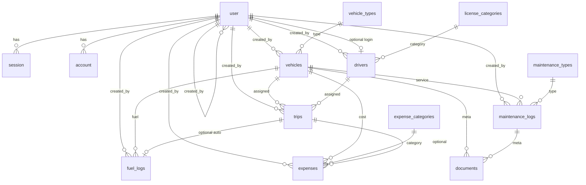

# 02 — Database Schema (v1 Locked Design)

> Implementation target for Drizzle/Postgres. **No code written yet** — this is the contract.

## 2.1 Postgres ENUMs (status machines only)

```sql
user_role:            fleet_manager | dispatcher | safety_officer | financial_analyst
vehicle_status:       available | on_trip | in_shop | retired
driver_status:        available | on_trip | off_duty | suspended
trip_status:          draft | dispatched | completed | cancelled
maintenance_status:   open | closed
notification_status:  pending | sent | failed | cancelled
document_entity_type: vehicle | maintenance_log
```

All other categorizations → **master tables**.

---

## 2.2 Master / config tables

> **No `regions` table** (ADR-043). Trip endpoints are free text.

### `vehicle_types`

| Column                               | Type         | Null | Default           | Notes               |
| ------------------------------------ | ------------ | ---- | ----------------- | ------------------- |
| id                                   | uuid         | NO   | gen_random_uuid() | **PK**              |
| code                                 | varchar(32)  | NO   |                   | e.g. `VAN`, `TRUCK` |
| name                                 | varchar(120) | NO   |                   |                     |
| is_active                            | boolean      | NO   | true              |                     |
| created_at / updated_at / deleted_at | timestamptz  |      |                   | same pattern        |

**Constraints:** unique `code` among non-deleted.

### `license_categories`

| Column                               | Type         | Null | Default           | Notes             |
| ------------------------------------ | ------------ | ---- | ----------------- | ----------------- |
| id                                   | uuid         | NO   | gen_random_uuid() | **PK**            |
| code                                 | varchar(32)  | NO   |                   | e.g. `LMV`, `HMV` |
| name                                 | varchar(120) | NO   |                   |                   |
| is_active                            | boolean      | NO   | true              |                   |
| created_at / updated_at / deleted_at |              |      |                   |                   |

### `expense_categories`

| Column                               | Type         | Null | Default           | Notes                       |
| ------------------------------------ | ------------ | ---- | ----------------- | --------------------------- |
| id                                   | uuid         | NO   | gen_random_uuid() | **PK**                      |
| code                                 | varchar(32)  | NO   |                   | e.g. `TOLL`, `FINE`, `MISC` |
| name                                 | varchar(120) | NO   |                   |                             |
| is_active                            | boolean      | NO   | true              |                             |
| created_at / updated_at / deleted_at |              |      |                   |                             |

**Note:** Expense categories = **toll / fine / misc only**. Do **not** store maintenance as expense rows.  
**Operational cost** = fuel + maintenance (ADR-044). Maintenance costs live only on `maintenance_logs`; UI may **link/display** them next to other expenses (ADR-045).

### `maintenance_types`

| Column                               | Type         | Null | Default           | Notes             |
| ------------------------------------ | ------------ | ---- | ----------------- | ----------------- |
| id                                   | uuid         | NO   | gen_random_uuid() | **PK**            |
| code                                 | varchar(32)  | NO   |                   | e.g. `OIL_CHANGE` |
| name                                 | varchar(120) | NO   |                   |                   |
| is_active                            | boolean      | NO   | true              |                   |
| created_at / updated_at / deleted_at |              |      |                   |                   |

---

## 2.3 Identity & access — **Better Auth** (ADR-036)

Auth is **Better Auth** with Drizzle + Postgres.  
Reference: [Database](https://better-auth.com/docs/concepts/database), [Session management](https://better-auth.com/docs/concepts/session-management).

Replaces scaffold `admin_users`. Do **not** invent a parallel custom password table.

**Strategy:** Better Auth **core schema** + `user.additionalFields` for TransitOps RBAC.  
Password is stored on **`account.password`** (credential provider), **not** on `user`.  
Sessions: **cookie-based**; session rows live in DB `session` table by default.

### `user` (Better Auth core + additional fields)

| Column                 | Type        | Null | Notes                                                                       |
| ---------------------- | ----------- | ---- | --------------------------------------------------------------------------- |
| id                     | text/uuid   | NO   | **PK** (Better Auth string id; generate uuid)                               |
| name                   | text        | NO   | Display name (maps from product “full name”)                                |
| email                  | text        | NO   | Unique login identity                                                       |
| email_verified         | boolean     | NO   | Better Auth core                                                            |
| image                  | text        | YES  | Optional avatar URL                                                         |
| created_at             | timestamptz | NO   | Core                                                                        |
| updated_at             | timestamptz | NO   | Core                                                                        |
| **role**               | user_role   | NO   | **additionalField** — exactly one app role; `input: false` on public signup |
| **phone_number**       | varchar(32) | YES  | **additionalField** optional                                                |
| **is_active**          | boolean     | NO   | **additionalField** default true; inactive cannot use app                   |
| **deleted_at**         | timestamptz | YES  | **additionalField** soft-disable; optional                                  |
| **created_by_user_id** | text        | YES  | **additionalField** FK → user.id (null for seed)                            |

**Indexes:** unique email; index `(role)`; index `(is_active)`.

**Auth rules:** session valid only if user `is_active = true` and `deleted_at IS NULL` (enforce via Better Auth hooks / app middleware).

### `session` (Better Auth core)

| Column     | Type        | Null | Notes                              |
| ---------- | ----------- | ---- | ---------------------------------- |
| id         | text        | NO   | **PK**                             |
| user_id    | text        | NO   | **FK → user.id** ON DELETE CASCADE |
| token      | text        | NO   | Unique session token (cookie)      |
| expires_at | timestamptz | NO   | Default ~7d; refresh via updateAge |
| ip_address | text        | YES  |                                    |
| user_agent | text        | YES  |                                    |
| created_at | timestamptz | NO   |                                    |
| updated_at | timestamptz | NO   |                                    |

### `account` (Better Auth core — password lives here)

| Column                           | Type        | Null | Notes                                |
| -------------------------------- | ----------- | ---- | ------------------------------------ |
| id                               | text        | NO   | **PK**                               |
| user_id                          | text        | NO   | **FK → user.id** CASCADE             |
| account_id                       | text        | NO   | For credential = user id             |
| provider_id                      | text        | NO   | e.g. `credential` for email/password |
| password                         | text        | YES  | Hashed password for email/password   |
| access_token / refresh_token / … | text/date   | YES  | OAuth fields (unused v1)             |
| created_at / updated_at          | timestamptz | NO   |                                      |

### `verification` (Better Auth core)

| Column                  | Type        | Null | Notes       |
| ----------------------- | ----------- | ---- | ----------- |
| id                      | text        | NO   | **PK**      |
| identifier              | text        | NO   | e.g. email  |
| value                   | text        | NO   | token/value |
| expires_at              | timestamptz | NO   |             |
| created_at / updated_at | timestamptz |      |             |

### Login UX (mockup) — role dropdown (ADR-047)

Login form fields: **email**, **password**, **role** (dropdown of four roles).

Server rules:

1. Authenticate email/password via Better Auth.
2. Load `user.role`.
3. If selected role ≠ `user.role` → reject (403 / invalid credentials style message). User does **not** switch roles at login; dropdown is a confirmation/selector matching their assigned role.
4. Optional UX: after email lookup, pre-select role (still validate).

### Failed login lockout (ADR-051)

Mockup: _“Account locked after 5 failed attempts.”_

Configure **Better Auth rate limiting** ([docs](https://better-auth.com/docs/concepts/rate-limit)):

```ts
rateLimit: {
  enabled: true,
  storage: "database", // preferred for multi-instance
  customRules: {
    "/sign-in/email": {
      window: 15 * 60, // 15 minutes (tune as needed)
      max: 5,          // 5 attempts then blocked until window resets
    },
  },
}
```

UI on 429: show lockout message + `X-Retry-After`.  
Optional table: Better Auth `rateLimit` when `storage: "database"`.

### Implementation notes

- Use `auth generate` with Drizzle adapter so schema stays aligned with Better Auth version.
- Map domain FKs (`created_by_user_id`, `drivers.user_id`) → `user.id`.
- Prefer Better Auth default table names unless remapped.
- No public self-signup; Fleet Manager / seed creates users with role set server-side (`additionalFields.role`, `input: false` on client signup).

---

## 2.4 Core fleet entities

### `vehicles`

| Column                               | Type           | Null | Default           | Notes                                          |
| ------------------------------------ | -------------- | ---- | ----------------- | ---------------------------------------------- |
| id                                   | uuid           | NO   | gen_random_uuid() | **PK**                                         |
| registration_number                  | varchar(32)    | NO   |                   | **Unique** among non-deleted                   |
| name_model                           | varchar(160)   | NO   |                   | Vehicle name/model                             |
| vehicle_type_id                      | uuid           | NO   |                   | **FK → vehicle_types.id**                      |
| max_load_capacity_kg                 | numeric(12,2)  | NO   |                   | > 0                                            |
| odometer_km                          | numeric(12,1)  | NO   | 0                 | Current reading; updated only on trip complete |
| acquisition_cost_inr                 | numeric(12,2)  | NO   |                   | ≥ 0                                            |
| status                               | vehicle_status | NO   | `available`       |                                                |
| notes                                | text           | YES  | null              |                                                |
| created_at / updated_at / deleted_at |                |      |                   |                                                |
| created_by_user_id                   | uuid           | YES  |                   | **FK → user.id**                               |

**Indexes:** unique `registration_number` WHERE deleted_at IS NULL; index `(status)`; index `(vehicle_type_id)`.

**Check:** `max_load_capacity_kg > 0`; `odometer_km >= 0`; `acquisition_cost_inr >= 0`.

### `drivers`

| Column                               | Type          | Null | Default           | Notes                                         |
| ------------------------------------ | ------------- | ---- | ----------------- | --------------------------------------------- |
| id                                   | uuid          | NO   | gen_random_uuid() | **PK**                                        |
| full_name                            | varchar(160)  | NO   |                   |                                               |
| license_number                       | varchar(64)   | NO   |                   | Unique among non-deleted                      |
| license_category_id                  | uuid          | NO   |                   | **FK → license_categories.id**                |
| license_expiry_date                  | date          | NO   |                   | Assign blocked if < current_date              |
| contact_number                       | varchar(32)   | NO   |                   |                                               |
| safety_score                         | smallint      | NO   | 100               | 0–100; FM + Safety edit                       |
| status                               | driver_status | NO   | `available`       |                                               |
| user_id                              | uuid          | YES  | null              | **FK → user.id**, UNIQUE; optional login link |
| notes                                | text          | YES  | null              |                                               |
| created_at / updated_at / deleted_at |               |      |                   |                                               |
| created_by_user_id                   | uuid          | YES  |                   | **FK → user.id**                              |

**No `trip_completion_pct` column** (ADR-049).  
**Compute on the fly** after drivers list/detail API (in API response and/or frontend):  
`completed_count / assigned_count * 100` from `trips` (e.g. Alex 48 completed of 50 assigned → **96%**). Never persist this percentage.

**Indexes:** unique `license_number` WHERE deleted_at IS NULL; unique `user_id` WHERE user_id IS NOT NULL; index `(status)`; index `(license_expiry_date)`.

**Check:** `safety_score BETWEEN 0 AND 100`.

---

## 2.5 Trips

### `trips`

| Column                               | Type          | Null | Default           | Notes                                     |
| ------------------------------------ | ------------- | ---- | ----------------- | ----------------------------------------- |
| id                                   | uuid          | NO   | gen_random_uuid() | **PK**                                    |
| status                               | trip_status   | NO   | `draft`           |                                           |
| source                               | varchar(255)  | NO   |                   | Free text e.g. `Gandhinagar Depot`        |
| destination                          | varchar(255)  | NO   |                   | Free text e.g. `Ahmedabad Hub`            |
| vehicle_id                           | uuid          | NO   |                   | **FK → vehicles.id**                      |
| driver_id                            | uuid          | NO   |                   | **FK → drivers.id**                       |
| cargo_weight_kg                      | numeric(12,2) | NO   |                   | > 0; ≤ vehicle capacity on dispatch       |
| planned_distance_km                  | numeric(12,2) | NO   |                   | > 0                                       |
| start_odometer_km                    | numeric(12,1) | YES  | null              | Set on **dispatch** from vehicle.odometer |
| end_odometer_km                      | numeric(12,1) | YES  | null              | Set on **complete**                       |
| actual_distance_km                   | numeric(12,2) | YES  | null              | Generated/stored: end − start on complete |
| fuel_consumed_liters                 | numeric(12,3) | YES  | null              | Required on complete                      |
| fuel_cost_inr                        | numeric(12,2) | YES  | null              | Required on complete                      |
| dispatched_at                        | timestamptz   | YES  | null              |                                           |
| completed_at                         | timestamptz   | YES  | null              |                                           |
| cancelled_at                         | timestamptz   | YES  | null              |                                           |
| cancel_reason                        | text          | YES  | null              | Recommended when cancelled                |
| created_by_user_id                   | uuid          | NO   |                   | **FK → user.id** (dispatcher)             |
| created_at / updated_at / deleted_at |               |      |                   |                                           |

**Indexes:** `(status)`; `(vehicle_id, status)`; `(driver_id, status)`; `(dispatched_at)`; `(completed_at)`.

**Partial unique (concurrency safety — recommended):**

- At most one **dispatched** trip per vehicle:  
  `UNIQUE(vehicle_id) WHERE status = 'dispatched' AND deleted_at IS NULL`
- At most one **dispatched** trip per driver:  
  `UNIQUE(driver_id) WHERE status = 'dispatched' AND deleted_at IS NULL`

**Checks:** cargo/planned_distance > 0; on complete end_odometer ≥ start_odometer.

**Complete contract (ADR-053):** same transaction must write `fuel_logs` + one or more `expenses` rows (with `trip_id`) then set trip completed and free vehicle/driver.

---

## 2.6 Maintenance

### `maintenance_logs` (PK bigserial)

| Column                 | Type               | Null | Default | Notes                           |
| ---------------------- | ------------------ | ---- | ------- | ------------------------------- |
| id                     | bigserial          | NO   |         | **PK**                          |
| vehicle_id             | uuid               | NO   |         | **FK → vehicles.id**            |
| maintenance_type_id    | uuid               | NO   |         | **FK → maintenance_types.id**   |
| status                 | maintenance_status | NO   | `open`  |                                 |
| description            | text               | YES  | null    |                                 |
| vendor_name            | varchar(160)       | YES  | null    | Rich field                      |
| cost_inr               | numeric(12,2)      | NO   | 0       | ≥ 0; operational cost component |
| odometer_at_service_km | numeric(12,1)      | YES  | null    |                                 |
| next_due_odometer_km   | numeric(12,1)      | YES  | null    |                                 |
| started_at             | timestamptz        | NO   | now()   |                                 |
| completed_at           | timestamptz        | YES  | null    | Set when closed                 |
| created_by_user_id     | uuid               | NO   |         | **FK → user.id**                |
| created_at             | timestamptz        | NO   | now()   |                                 |
| updated_at             | timestamptz        | NO   | now()   |                                 |

**No soft delete** — close instead of delete.

**Partial unique:** one open job per vehicle:  
`UNIQUE(vehicle_id) WHERE status = 'open'`

**Indexes:** `(vehicle_id, status)`; `(started_at)`.

---

## 2.7 Fuel & expenses

### `fuel_logs` (PK bigserial)

| Column             | Type          | Null | Default | Notes                                                |
| ------------------ | ------------- | ---- | ------- | ---------------------------------------------------- |
| id                 | bigserial     | NO   |         | **PK**                                               |
| vehicle_id         | uuid          | NO   |         | **FK → vehicles.id**                                 |
| trip_id            | uuid          | YES  | null    | **FK → trips.id**; set when auto-created on complete |
| liters             | numeric(12,3) | NO   |         | > 0                                                  |
| cost_inr           | numeric(12,2) | NO   |         | ≥ 0                                                  |
| logged_at          | date          | NO   |         | Fuel date                                            |
| notes              | text          | YES  | null    |                                                      |
| created_by_user_id | uuid          | NO   |         | **FK → user.id**                                     |
| created_at         | timestamptz   | NO   | now()   |                                                      |
| updated_at         | timestamptz   | NO   | now()   |                                                      |

**Indexes:** `(vehicle_id, logged_at)`; unique optional `(trip_id)` WHERE trip_id IS NOT NULL (one auto fuel row per completed trip).

### `expenses` (PK bigserial)

**Toll / fine / misc only** — never insert maintenance rows here (ADR-045).

| Column                  | Type          | Null | Default | Notes                                                                                                  |
| ----------------------- | ------------- | ---- | ------- | ------------------------------------------------------------------------------------------------------ |
| id                      | bigserial     | NO   |         | **PK**                                                                                                 |
| vehicle_id              | uuid          | NO   |         | **FK → vehicles.id**                                                                                   |
| expense_category_id     | uuid          | NO   |         | **FK → expense_categories.id**                                                                         |
| trip_id                 | uuid          | YES  | null    | **FK → trips.id**; **required when written at trip complete** (null only for non-trip manual expenses) |
| amount_inr              | numeric(12,2) | NO   |         | > 0                                                                                                    |
| incurred_on             | date          | NO   |         |                                                                                                        |
| description             | text          | YES  | null    |                                                                                                        |
| created_by_user_id      | uuid          | NO   |         | **FK → user.id**                                                                                       |
| created_at / updated_at | timestamptz   | NO   | now()   |                                                                                                        |

**Indexes:** `(vehicle_id, incurred_on)`; `(expense_category_id)`; `(trip_id)`.

**Trip complete (ADR-053):** Dispatcher must log trip expense(s) into this table (with `trip_id`) in the same transaction as odometer + fuel_log + status flips.

**Fuel & Expense screen (mockup):**  
Fuel table from `fuel_logs`. “Other expenses” table: trip-linked `expenses` (toll/misc) **plus a computed column** `maint_linked` = sum of `maintenance_logs.cost_inr` for that vehicle (and/or period) — **read-only link**, not a second write of maintenance cost.

---

## 2.8 Documents & notifications (bonus-ready)

### `documents` (PK uuid)

| Column              | Type                 | Null | Default           | Notes                              |
| ------------------- | -------------------- | ---- | ----------------- | ---------------------------------- |
| id                  | uuid                 | NO   | gen_random_uuid() | **PK**                             |
| entity_type         | document_entity_type | NO   |                   | vehicle \| maintenance_log         |
| entity_id           | text                 | NO   |                   | UUID or bigserial string of parent |
| file_name           | varchar(255)         | NO   |                   | Original name                      |
| storage_path        | text                 | NO   |                   | Local/public relative path         |
| mime_type           | varchar(127)         | NO   |                   |                                    |
| size_bytes          | bigint               | NO   |                   | ≥ 0                                |
| uploaded_by_user_id | text                 | NO   |                   | **FK → user.id** (Better Auth)     |
| created_at          | timestamptz          | NO   | now()             |                                    |
| deleted_at          | timestamptz          | YES  | null              | Soft delete                        |

**Indexes:** `(entity_type, entity_id)`.

> Polymorphic `entity_id` as text is pragmatic for uuid + bigserial parents. App layer validates existence.

**Upload policy (ADR-040) — not DB columns; app + ENV:**

| ENV (suggested)       | Default         | Meaning                                   |
| --------------------- | --------------- | ----------------------------------------- |
| `UPLOAD_MAX_BYTES`    | `5242880` (5MB) | Max file size                             |
| `UPLOAD_ALLOWED_MIME` | `*` (all types) | Comma-separated MIME list, or `*` for all |

Validate on upload before write; reject oversize / disallowed type with clear error.

### `notification_outbox` (PK bigserial)

License expiry (and future) email pipeline.

| Column          | Type                | Null | Default   | Notes                        |
| --------------- | ------------------- | ---- | --------- | ---------------------------- |
| id              | bigserial           | NO   |           | **PK**                       |
| channel         | varchar(32)         | NO   | `'email'` |                              |
| template_key    | varchar(64)         | NO   |           | e.g. `driver_license_expiry` |
| recipient_email | varchar(254)        | NO   |           |                              |
| payload_json    | jsonb               | NO   |           | Driver id, expiry, days left |
| status          | notification_status | NO   | `pending` |                              |
| scheduled_for   | timestamptz         | NO   | now()     |                              |
| sent_at         | timestamptz         | YES  | null      |                              |
| last_error      | text                | YES  | null      |                              |
| created_at      | timestamptz         | NO   | now()     |                              |
| updated_at      | timestamptz         | NO   | now()     |                              |

**Indexes:** `(status, scheduled_for)`.

**Worker note (ADR-041):** Table is designed now; cron/worker that drains outbox is a **later task** — not v1 required behavior.

---

## 2.9 ER diagram (logical)



---

## 2.10 Derived metrics (not stored tables)

| Metric                         | Formula / definition                                                           |
| ------------------------------ | ------------------------------------------------------------------------------ |
| **Active vehicles**            | Non-retired count — `status != 'retired' AND deleted_at IS NULL` (ADR-035)     |
| Available vehicles             | `status = available` AND not deleted                                           |
| Vehicles in maintenance        | `status = in_shop`                                                             |
| Active trips                   | `status = dispatched`                                                          |
| Pending trips                  | `status = draft`                                                               |
| Drivers on duty                | `status = on_trip`                                                             |
| Fleet utilization %            | `(on_trip / (available + on_trip + in_shop)) × 100` — retired excluded         |
| Fuel efficiency                | sum(actual_distance_km) / sum(fuel liters) per vehicle                         |
| **Operational cost / vehicle** | **`SUM(fuel_logs.cost_inr) + SUM(maintenance_logs.cost_inr)`** (ADR-044)       |
| Toll/misc expenses             | `SUM(expenses.amount_inr)` — **not** in operational cost auto total            |
| Vehicle ROI / Monthly revenue  | **Static demo placeholders** for hackathon UI only (ADR-050); no revenue table |

**Dashboard filters (v1):** **vehicle type + status only**. No region filter (ADR-043 / ADR-052).

**No Settings table** — currency INR and distance km are app constants (ADR-046).

---

## 2.11 Seed expectations (data, not code)

1. Four Better Auth users (one per role) + credential `account` rows.
2. Masters: ≥2 vehicle types, ≥2 license categories, ≥3 expense categories (TOLL/FINE/MISC), ≥3 maintenance types.
3. Sample vehicles/drivers/trips in various statuses for dashboard.
4. Optional static analytics demo constants for ROI % / monthly revenue display.

---

## 2.12 Scaffold migration impact

| Existing            | Action when implementing                    |
| ------------------- | ------------------------------------------- |
| `admin_users`       | Drop / replace with Better Auth core tables |
| Auth username login | Email + password + role dropdown validation |
| Empty domain schema | Create domain tables above (no regions)     |
